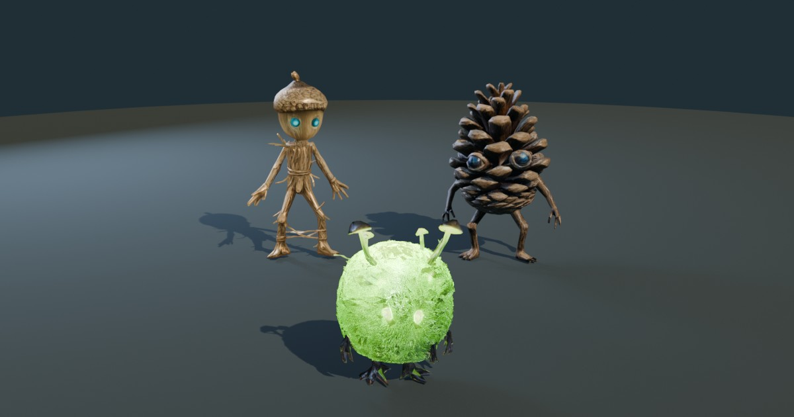

# Forest creatures · AR

A small WebAR demo: three rigged creatures stand on the floor in front of your phone's camera,
and tapping them makes them react.

**Try it:** https://warmishduck.github.io/pulse-duck-ar/ — open it on a phone (on a desktop it
shows a QR code, because the camera tracking needs a phone).



## What's in it

- **Acorn** — plays one of five animations when tapped (the first tap is always the jump), then
  settles back into its idle loop.
- **Pinecone** — hops when tapped.
- **Glowcap** — tap it to make it glow; tap again to switch it off.
- A **photo button** (camera feed plus creatures, ready to share), a **mute button**, and a
  first-tap hint. The sound effects are synthesized in the browser, so there are no audio files.

## Run it locally

```
npm install
npm run serve
```

Camera access needs HTTPS, so to try it on a phone, expose the dev server through a tunnel
(for example `ngrok http 5173`) and add the tunnel's domain to `server.allowedHosts` in
`vite.config.js`.

## Deploy

Pushing to `main` builds the site and publishes it to GitHub Pages
(`.github/workflows/deploy.yml`). To build by hand: `npm run build` (output in `dist/`).

## How it's put together

- `src/app.js` — starts the 8th Wall camera pipeline.
- `src/threejs-scene-init.js` — the three.js scene: loading the models, lighting, and how each
  creature reacts to a tap. The list of creatures and their behaviour is the `items` array at the top.
- `src/ui.js`, `src/index.css` — loading note, hint, mute and photo buttons.
- `src/sound.js` — the synthesized sound effects.
- `src/assets/` — the `.glb` models. Keep them small: they are downloaded by every visitor.

## Notes

- Camera tracking comes from the 8th Wall engine binary, loaded from jsDelivr and pinned to
  `1.0.0` in `index.html`. The hosted 8th Wall platform has been shut down; the engine
  continues at [8thwall.org](https://8thwall.org), including the
  [terms for the distributed binary](https://8thwall.org/docs/migration/faq#distributed-engine-binary-license-and-permitted-use).
- Started from 8th Wall's "three.js: World Effects" example.
- The creature models come from the author's own game project.
