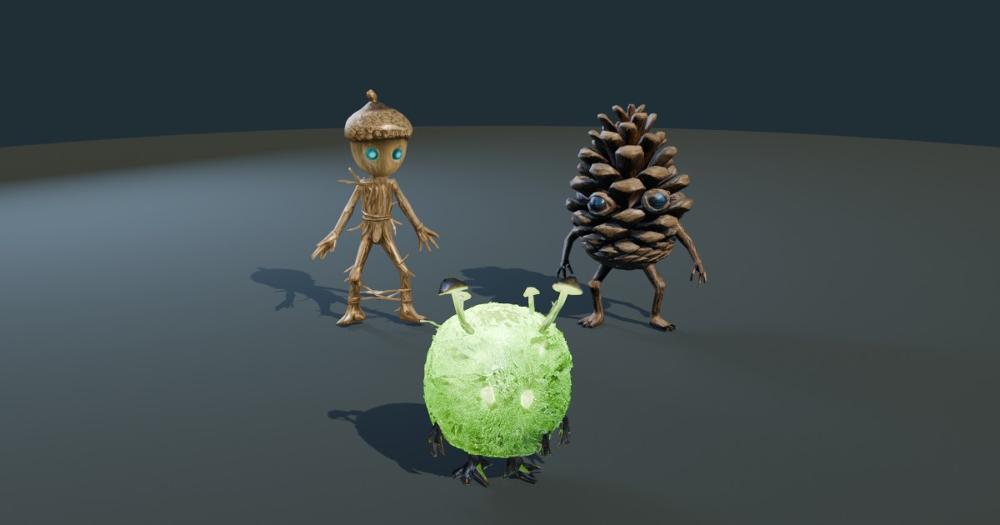

# Forest creatures · AR

A small WebAR demo: three rigged creatures stand on the floor in front of your phone's camera,
and tapping them makes them react.

**Try it:** https://warmishduck.github.io/pulse-duck-ar/ — open it on a phone (on a desktop it
shows a QR code, because the camera tracking needs a phone).



## What's in it

- **Acorn** — plays one of five animations when tapped (the first tap is always the jump), then
  settles back into its idle loop.
- **Pinecone** — hops when tapped.
- **Glowcap** — tap it to make it glow; tap again to switch it off.
- A **photo button** (camera feed plus creatures, ready to share), a **mute button**, and a
  first-tap hint. The sound effects are synthesized in the browser, so there are no audio files.
- A **level mode** (the button at the top left): a small diorama of a level from the game,
  "Light the way", which is a puzzle for the two of them.
  - You steer the **acorn** with the on-screen buttons (or the arrow keys and space bar on a
    computer). The **Glowcap** is slow and cannot jump far; you send it somewhere by tapping the
    ground there, and tapping the Glowcap itself calls it to the acorn. It stops at ledges.
  - The Glowcap always glows, and the "bloom" platforms bridging the gap are solid only while it
    is close enough to light them, so the acorn can cross only if the Glowcap is standing near
    the bridge. Take it away and the bridge lets the acorn fall. The row of glowing platforms
    over the start slab works the same way: jump up onto it, and it drops you when the light
    moves off. You can stand on these platforms, but walk through their sides.
  - The Glowcap cannot follow over the gap. At the far side is a glowing anchor: stand next to it
    and press the button to grow a branch back across the gap, which the Glowcap can walk over.
    The branch holds only while the acorn stays near the anchor.
  - The level is won when the **Glowcap** reaches the green sphere; it then starts over.

## Exhibits and QR codes

The page shows different content depending on its address, so one site serves every QR code:

- `/?c=03` opens the AR view of exhibit `03`: the creatures that stand there, and a mini-game if it has one.
- `/` (no code, or a code that isn't recognised) opens the **welcome page**: no camera, just a 3D
  preview of the creatures standing together, and a line telling the visitor to scan the QR code
  next to an exhibit.
- `/?c=demo` is the whole demo (all the creatures and the game), for showing people.

What each code shows is set in `src/content/`, not in code, so adding an exhibit copies nothing:

- `creatures.js` — the kinds of creature: which model, how tall, how it reacts to a tap.
- `exhibits.js` — one entry per code: which creatures stand there (and where), and which game, if any.
  `startIn: 'game'` opens straight into the game (the yard game has no creatures).

To add a creature, put its `.glb` in `src/assets/` and add an entry to `creatures.js`; to add an exhibit,
add an entry to `exhibits.js`. Only the models of the exhibit being viewed are downloaded. A QR code only
holds the code (`https://<site>/?c=03`), so what stands at an exhibit can be changed without reprinting.
`01`, `02`, `03`, `demo` and `yard` are stand-ins for trying this out with the three creatures that exist.
`npm test` checks the config (every creature has its model, every exhibit is complete, the address parsing).

## Run it locally

```
npm install
npm run serve
```

Camera access needs HTTPS, so to try it on a phone, expose the dev server through a tunnel
(for example `ngrok http 5173`) and add the tunnel's domain to `server.allowedHosts` in
`vite.config.js`.

## Deploy

Pushing to `main` builds the site and publishes it to GitHub Pages
(`.github/workflows/deploy.yml`). To build by hand: `npm run build` (output in `dist/`).

## How it's put together

- `src/app.js` — the entry point: reads the address (`src/route.js`), then starts either the welcome
  page (`src/welcome.js`) or the 8th Wall camera pipeline for that exhibit.
- `src/threejs-scene-init.js` — the AR scene for one exhibit: the two modes (creatures / game), taps,
  the photo button.
- `src/showcase.js` — loads and animates a set of creatures and makes them react to taps; used by
  both the AR scene and the welcome page. `src/lights.js` is the lighting they share.
- `src/content/` — the creatures and the exhibits (see above). `src/models.js` finds model files by name.
- `src/i18n.js` — the languages and the language switch's state; all on-screen text lives here.
- `src/level.js` — the level diorama: builds the platforms, the acorn, the Glowcap and the branch,
  and scrolls a window over the level. `src/level-data.js` holds the level itself (taken from the
  game's `light_the_way.tscn`).
- `src/platformer.js` — the platformer physics, with no three.js in it. It uses the numbers from the
  game's scripts (gravity, jump, speed, coyote time; the Glowcap's slow walk and 0.3 hop) so the
  characters feel the same. `src/branch.js` is the branch's curve and the slope that is walked on.
  `npm test` checks all of it against the level's rules.
- `src/rig.js`, `src/glow.js` — helpers shared by both modes: placing rigged characters, and the glow.
- `src/ui.js`, `src/index.css` — the AR view's loading note, hints, mode switch, the level's buttons,
  mute, language switch and photo.
- `src/sound.js` — the synthesized sound effects.
- `src/assets/` — the `.glb` models. Keep them small: they are downloaded by every visitor.

## Self-hosted engine

Camera tracking (world tracking / SLAM, not image targets) comes from the 8th Wall
**Distributed Engine Binary**. The hosted 8th Wall platform has been shut down; the engine itself
continues at [8thwall.org](https://8thwall.org). This project vendors it — the files live in
`public/external/xr/` and are served from this site, not from a CDN — so the site has **no
third-party dependency at runtime** (important for a museum with patchy Wi-Fi: once the ~8 MB
engine is cached, it stays working).

- `xr.js`, `xr-slam.js` (its SLAM chunk, fetched lazily — `xr-face.js` and the face/segmentation
  `resources/` this project doesn't use were left out), `xrextras.js`, `landing-page.js`, and
  `resources/` (the fonts/icons/images `xrextras` and `landing-page` draw their UI from — the
  loading screen, the "open on your phone" QR fallback for desktop, etc). All from npm package
  version `1.0.0` of `@8thwall/engine-binary`, `@8thwall/xrextras`, `@8thwall/landing-page`.
- **Licence terms** (from the [distributed binary FAQ](https://8thwall.org/docs/migration/faq#distributed-engine-binary-license-and-permitted-use)):
  running/hosting it yourself and distributing it as part of this project is explicitly permitted;
  modifying, reverse-engineering, decompiling or redistributing an altered copy is not; Niantic
  Spatial's copyright notice must stay in the file, and this project must identify Niantic Spatial
  as the engine's creator and reference the licence — this section is that reference. **Never edit
  the files under `public/external/xr/`.** To update the engine, download a fresh copy of the same
  files from `https://cdn.jsdelivr.net/npm/@8thwall/<package>@<version>/dist/...` (or
  `https://data.jsdelivr.com/v1/packages/npm/@8thwall/<package>@<version>` lists a package's exact
  files) and replace them whole; `.gitattributes` keeps git from rewriting their line endings.
- Started from 8th Wall's "three.js: World Effects" example.
- The creature models come from the author's own game project.
